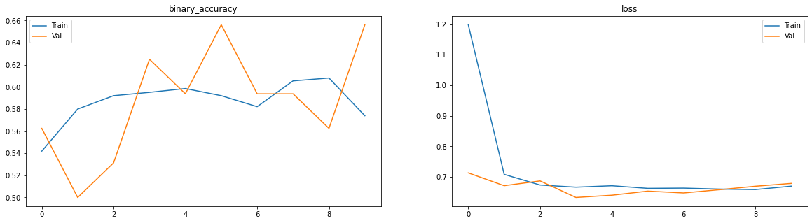
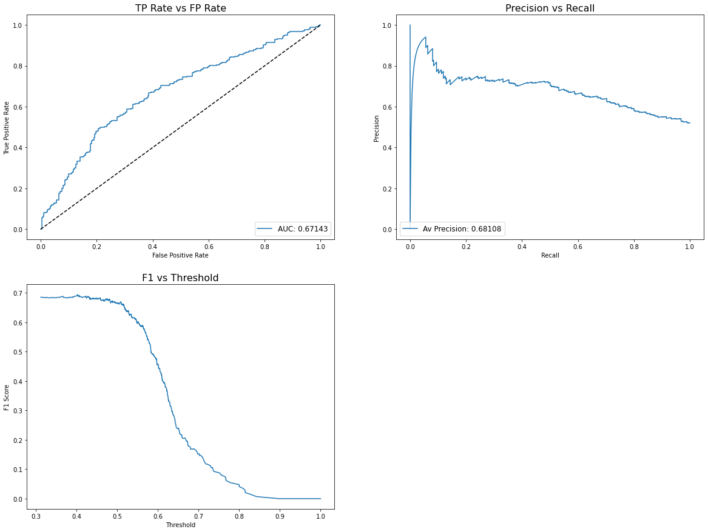

# FDA  Submission

**Your Name:** Manuel Mendoza.

**Name of your Device:** Deep Learning Model for Pneumonia Detection.

## Algorithm Description

### 1. General Information

**Intended Use Statement:**
<br>This algorithm is intended only to assists radiologists when diagnosing pneumonia on Chest X-Rays. It should not be used as a substitute for radiologists or any clinician in the clinical setting.

**Indications for Use:**
<br>This algorithm could be applied in patients of ages from 1 to 95 years old, with medical history indicating pneumonia. The X-Ray study position must be either PA or AP.

**Device Limitations:**
<br>Since the algorithm works through an architecture of convolutional neural networks, GPU and RAM resources must be presented in the desire device.
Some of the following preexisting or suspected conditions may not disturb in the algorithm output: Infiltration, effusion, atelectasis, nodules, mass, pneumothorax, consolidations, pleural thickening, cardiomegaly, emphysema, edema, fibrosis or hernias. Any other condition could influence in the model's prediction.

**Clinical Impact of Performance:**
<br>Four possible cases can be taken into consideration at the momento of evaluating the impact of the algorithm's performance by its own:
- True Positive: *Average impact* since any further actions and procedures would follow the same path as if a clinician had examined the study.
- True Negative: *Low impact* since no actions or procedures should correctly take place for the diagnosis of pneumonia.
- False Positive: *Medium impact* since the patient would be involved in unnecessary procedure, but their health would not at stake.
- False Negative: *High impact* since the patient would not take the necessary procedures, risking their condition.

<br>With these four scenarios in mind, the algorithm's prediction should only be used to assist the radiologist's final decision.

### 2. Algorithm Design and Function


**DICOM Checking Steps:**
<br>The DICOM file has to go throw the following filter steps:
1. The modality must be DX (X-Ray).
2. The body part examined must be CHEST.
3. The patient's position must be either PA or AP.

All three validations have to be successful to continue with the preprocessing step.

**Preprocessing Steps:**
<br>The preprocessing steps are:
1. Extract pixel array from DICOM file.
2. Normalize pixel dividing their values by 255.
3. Resize image to a 224x224 shape

**CNN Architecture:**
<br>The first block of the architecture contains the VGG-16 model, extracting the last linear layers. From there, three new linear layers where added with dropout between each of them. `Adam` was selected as the model's optimizer and the loss function for the training step was the `Binary Cross-Entropy` function.

```python
model = Sequential()

# VGG model
model.add(load_pretrained_model('flatten'))

# Dense layers
model.add(Dense(2048, activation='relu'))
model.add(Dropout(0.4))
model.add(Dense(2048, activation='relu'))
model.add(Dropout(0.2))
model.add(Dense(1, activation='sigmoid'))

# Optimizer
optimizer = Adam(learning_rate=lr)
loss = 'binary_crossentropy'

# Compite model
model.compile(optimizer=optimizer, loss=loss, metrics=['binary_accuracy'])
```

### 3. Algorithm Training

**Parameters:**
<br>Augmentation used during training:

```python
idg = ImageDataGenerator(
  rescale = 1./255,
  horizontal_flip = True,
  vertical_flip = False,
  height_shift_range = 0.1,
  width_shift_range = 0.1,
  rotation_range = 15,
  zoom_range = 0.1,
  fill_mode = 'constant',
  samplewise_center = True,
  samplewise_std_normalization = True
)
```

List of parameters

| Parameter     | Value     |
|---------------|-----------|
| Batch size    | 32        |
| Learning rate | 7e-4      |
| Epochs        | 10        |

All VGG layers were frozen for the training step, whereas all the three new linear layers were trained to detect the pneumonia.


**Figure 1.** Training accuracy and loss graphs


**Figure 1.** Metrics used to evaluate the model's performance

**Final Threshold and Explanation:**

### 4. Databases
 (For the below, include visualizations as they are useful and relevant)

**Description of Training Dataset:**


**Description of Validation Dataset:**


### 5. Ground Truth


### 6. FDA Validation Plan

**Patient Population Description for FDA Validation Dataset:**

**Ground Truth Acquisition Methodology:**

**Algorithm Performance Standard:**
