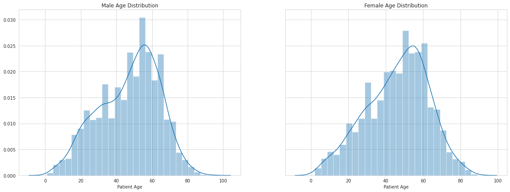
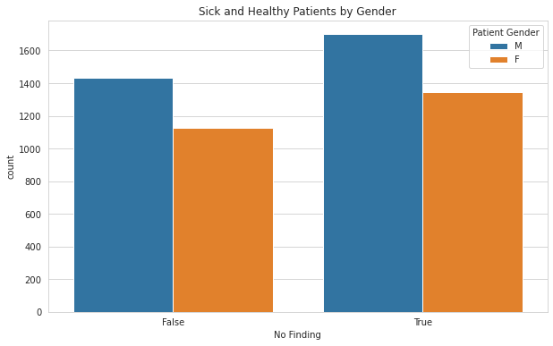
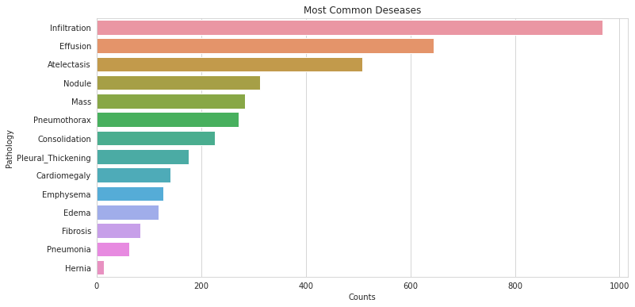

# FDA  Submission

**Your Name:** Manuel Mendoza.

**Name of your Device:** Deep Learning Model for Pneumonia Detection.

## Algorithm Description

### 1. General Information

**Intended Use Statement:**
<br>This algorithm is intended only to assists radiologists when diagnosing pneumonia on Chest X-Rays. It should not be used as a substitute for radiologists or any clinician in the clinical setting.

**Indications for Use:**
<br>This algorithm could be applied in patients of ages from 1 to 95 years old, with medical history indicating pneumonia. The X-Ray study position must be either PA or AP.

**Device Limitations:**
<br>Since the algorithm works through an architecture of convolutional neural networks, GPU and RAM resources must be presented in the desire device.
Some of the following preexisting or suspected conditions may not disturb in the algorithm output: Infiltration, effusion, atelectasis, nodules, mass, pneumothorax, consolidations, pleural thickening, cardiomegaly, emphysema, edema, fibrosis or hernias. Any other condition could influence in the model's prediction.

**Clinical Impact of Performance:**
<br>Four possible cases can be taken into consideration at the momento of evaluating the impact of the algorithm's performance by its own:
- True Positive: *Average impact* since any further actions and procedures would follow the same path as if a clinician had examined the study.
- True Negative: *Low impact* since no actions or procedures should correctly take place for the diagnosis of pneumonia.
- False Positive: *Medium impact* since the patient would be involved in unnecessary procedure, but their health would not at stake.
- False Negative: *High impact* since the patient would not take the necessary procedures, risking their condition.

<br>With these four scenarios in mind, the algorithm's prediction should only be used to assist the radiologist's final decision.

### 2. Algorithm Design and Function


**DICOM Checking Steps:**
<br>The DICOM file has to go throw the following filter steps:
1. The modality must be DX (X-Ray).
2. The body part examined must be CHEST.
3. The patient's position must be either PA or AP.

All three validations have to be successful to continue with the preprocessing step.

**Preprocessing Steps:**
<br>The preprocessing steps are:
1. Extract pixel array from DICOM file.
2. Normalize pixel dividing their values by 255.
3. Resize image to a 224x224 shape

**CNN Architecture:**
<br>The first block of the architecture contains the VGG-16 model, extracting the last linear layers. From there, three new linear layers where added with dropout between each of them. `Adam` was selected as the model's optimizer and the loss function for the training step was the `Binary Cross-Entropy` function.

```python
model = Sequential()

# VGG model
model.add(load_pretrained_model('flatten'))

# Dense layers
model.add(Dense(2048, activation='relu'))
model.add(Dropout(0.4))
model.add(Dense(2048, activation='relu'))
model.add(Dropout(0.2))
model.add(Dense(1, activation='sigmoid'))

# Optimizer
optimizer = Adam(learning_rate=lr)
loss = 'binary_crossentropy'

# Compite model
model.compile(optimizer=optimizer, loss=loss, metrics=['binary_accuracy'])
```

### 3. Algorithm Training

**Parameters:**
<br>Augmentation used during training:

```python
idg = ImageDataGenerator(
  rescale = 1./255,
  horizontal_flip = True,
  vertical_flip = False,
  height_shift_range = 0.1,
  width_shift_range = 0.1,
  rotation_range = 15,
  zoom_range = 0.1,
  fill_mode = 'constant',
  samplewise_center = True,
  samplewise_std_normalization = True
)
```

List of parameters

| Parameter     | Value     |
|---------------|-----------|
| Batch size    | 32        |
| Learning rate | 7e-4      |
| Epochs        | 10        |

All VGG layers were frozen for the training step, whereas all the three new linear layers were trained to detect the pneumonia.


**Figure 1.** Training accuracy and loss graphs


**Figure 2.** Metrics used to evaluate the model's performance

**Final Threshold and Explanation:**
<br>From the Threshold vs F1 Score graph, the threshold was extracted taking the F1 max value in the graph and detecting the threshold value at that point, which turn out to be `0.403407`.

### 4. Databases
The EDA analysis showed a normal distribution for male and female ages as expected:


**Figure 3.** Age distribution

Moreover, it was also concluded a balanced between sick and health patients:

**Figure 4.** Sick vs Healthy patients

But the deseases distribution showed a low number of samples for pneumonia and a high presence of infiltration, effusion and atelectasis cases:


**Figure 5.** Deseases distribution

**Description of Training Dataset:**
<br>The training dataset consisted of the 80% of the cases presented. Nevertheless, since pneumonia cases were low in comparison with other deseases, a balanced readjustment was necessary.
<br>The final distribution after balancing the dataset was as follows:

|Desease              | Samples  | Percentage  |
|---------------------|----------|-------------|
|Pneumonia            | 1145     | 49.48%      |
|Infiltration         | 669      | 28.91%      |
|No Finding           | 662      | 28.61%      |
|Effusion             | 348      | 15.04%      |
|Atelectasis          | 332      | 14.35%      |
|Edema                | 280      | 12.1%       |
|Consolidation        | 159      | 6.87%       |
|Mass                 | 119      | 5.14%       |
|Nodule               | 117      | 5.06%       |
|Pneumothorax         | 79       | 3.41%       |
|Pleural_Thickening   | 75       | 3.24%       |
|Cardiomegaly         | 65       | 2.81%       |
|Emphysema            | 38       | 1.64%       |
|Fibrosis             | 29       | 1.25%       |
|Hernia               | 5        | 0.22%       |

**Description of Validation Dataset:**
<br>The validation set included the other 20% of the dataset and the same balancing procedure was applied to ease the post-training analysis.

### 5. Ground Truth
<br>Taking into account that the Findings label in the dataset were obtain by a NLP algorithm from thousands of reports already gives a error margin for interpretation that has to be considered. This, as well as the possibility of human error in some of these reports, leaves the reliability below 100%.

### 6. FDA Validation Plan

**Patient Population Description for FDA Validation Dataset:**
<br>The patients' population should consist of males and females from zero to 100 years old if possible, thinking that the life expectancy tendency is to increase with each year. Both genders should have a equal proportion of cases, and although other deseases are not the main goal of this algorithm, it would be important to consider cases of other deseases that either include or not pneumonia to increase the training area of the model.

**Ground Truth Acquisition Methodology:**
<br>Pneumonia is presented as a rare desease compared to other cases in the dataset such as infiltrations and effusion. This could indicated that this is a difficult desease to diagnose. Therefore, each case of pneumonia should be labeled by at least three different radiologists, independent one from the other. Saving the clinicians reports in digital files could bypass the NLP inaccuracies as well.

**Algorithm Performance Standard:**
<br>
